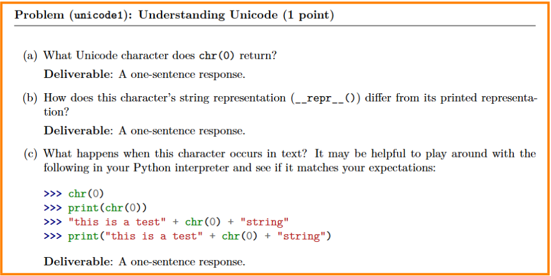
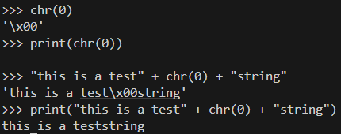
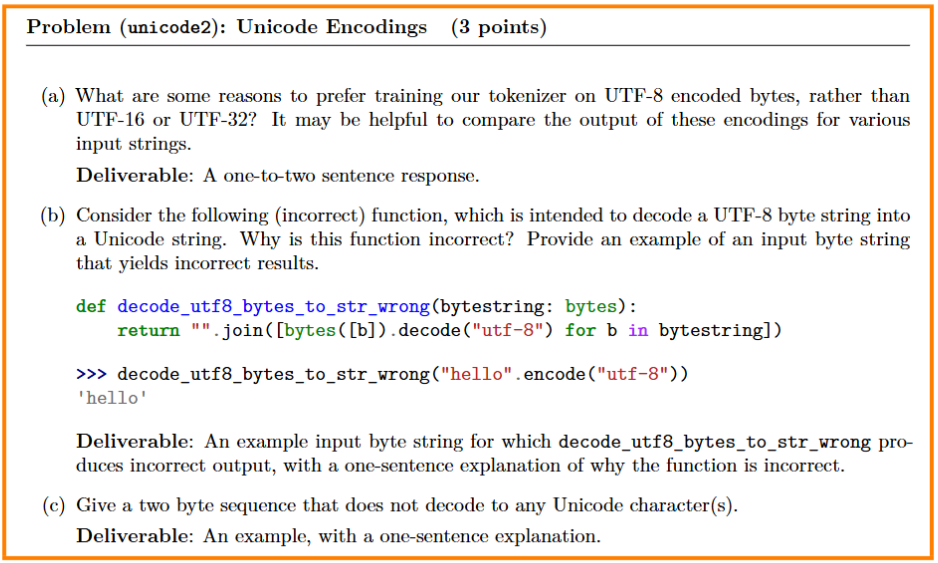
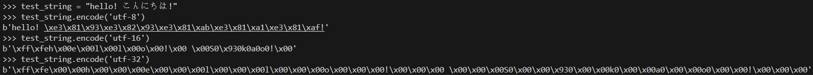
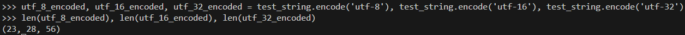
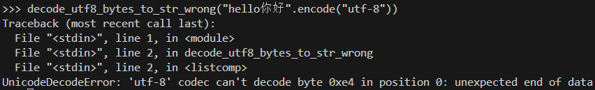

  
a) '\x00'  
b) __repr__() is a special function in a class to return a user defined string while directly call print(obj), the __str()__ is used  
c)  
  
Seems chr(0) is \x00 in string but will print nothing when call function print.  

  
a)  
  
The output is more readable in utf-8 while the input is within ASCII.  
  
The utf-8 will use less mem.  
b)Not all character is encoded into one byte. So decode byte by byte can cause crash like:  
  
c) b'\xc0\x80' this is valid in all three encoding format.  

